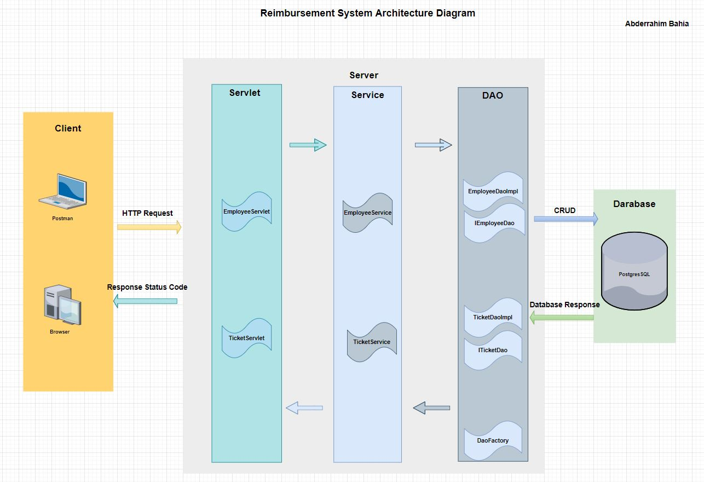

# ExpensesReimbursementSystem

---
 * [Introduction](Introduction)
 * [Technologies](Technologies)
 * [Architecture Diagram ](Architecture Diagram )
 * [ERD Diagram](ERD Diagram)
 * [Features Implemented](Features Implemented)
 * [FAQ](FAQ)
---
## I.Introduction
This project is an expense reimbursement system, designed to allow us
to demonstrate our understanding of the fundamentals of software development.
Employee expense reimbursement software allows you to input expenses for approval
through one application. during this project I built an API for employees  to submit
reimbursement requests and managers to approve or deny the submitted requests.
---
## II. Technologies
- JAVA 8
  - https://www.java.com/en/download/
- JDK 18.0.2 
  - https://www.oracle.com/java/technologies/downloads/
- NETBEANS IDE
  - https://netbeans.apache.org/download/nb14/nb14.html
- PostgresSQL
  - https://www.postgresql.org/download/
- Dbeaver
  - https://dbeaver.io/download/
- Postman
  - https://www.postman.com/downloads/
- Apache Maven 3.8.6
  - https://maven.apache.org/download.cgi
- Apache Tomcat 8.5.82
  - https://tomcat.apache.org/download-80.cgi
---
## III. Project Architecture Diagram 

---
##  IV. Database ERD Diagram
